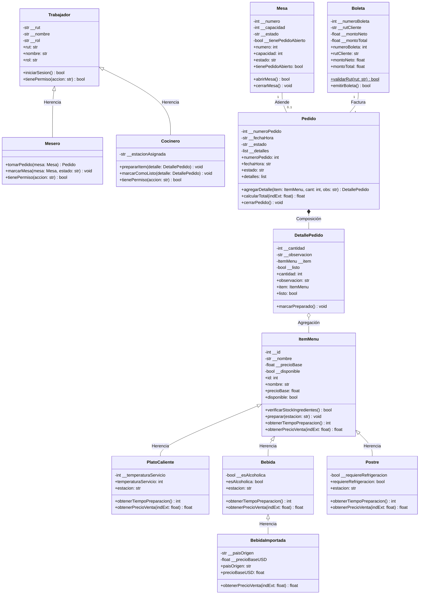

# INFORME EVALUACIÓN SUMATIVA N°2
## Programación Orientada a Objeto Seguro (TI3V21)
### Unidad de Aprendizaje 2: Implementación de Software Orientado a Objetos en Python

---

## 1. Portada
- **Asignatura:** Programación Orientada a Objeto Seguro
- **Código:** TI3V21
- **Docente:** Michael Arjel
- **Nombre del Equipo:** *(Completar con el nombre de su equipo)*
- **Integrantes:**
  - Integrante 1: *(Apellido Paterno, Apellido Materno, Nombres - RUT)*
  - Integrante 2: *(Apellido Paterno, Apellido Materno, Nombres - RUT)*
- **Negocio Asignado:** Sistema de Administración de Restaurante
- **Enlace al Repositorio GitHub:** *(Insertar URL pública del repositorio, ej: https://github.com/usuario/restaurante-inacap)*

---

## 2. Diagrama de Clases UML y Código Fuente

### 2.1 Diagrama de Clases del Negocio



### 2.2 Justificación de Cambios respecto a la Sumativa N°1
Respecto al diagrama conceptual original de la Evaluación Sumativa N°1, se incorporaron los siguientes refinamientos técnicos:
1. **Separación de responsabilidades en la jerarquía de `ItemMenu`:** Se formalizaron tres subtipos concretos (`PlatoCaliente`, `Bebida`, `Postre`) y la especialización `BebidaImportada` para permitir la sobreescritura polimórfica del método `obtenerPrecioVenta(indExt)` y `obtenerTiempoPreparacion()`.
2. **Excepciones de dominio:** Se definieron excepciones propias (`ItemSinStockError`, `MesaOcupadaError`, `PedidoCerradoError`, `RutInvalidoError`) en sustitución de retornos booleanos para cumplir con la programación defensiva y segura.

---

### 2.3 Implementación de Relaciones en Código

#### A. Relación de Herencia (Subtipos heredando con `super().__init__()` y Polimorfismo)
- **Archivo:** `model/platocaliente.py` (hereda de `model/itemmenu.py`)
- **Fragmento de código:**
```python
from model.itemmenu import ItemMenu

class PlatoCaliente(ItemMenu):
    def __init__(self, id_item: int, nombre: str, precioBase: float, disponible: bool, temperaturaServicio: int):
        super().__init__(id_item, nombre, precioBase, disponible)
        self.temperaturaServicio = temperaturaServicio

    @property
    def estacion(self) -> str:
        return "Cocina Caliente"

    def obtenerTiempoPreparacion(self) -> int:
        return 20

    def obtenerPrecioVenta(self, indExt: float = 1.0) -> float:
        return self.precioBase
```
- **Justificación técnica:** Se utiliza herencia simple. La subclase reutiliza la inicialización de los atributos comunes llamando a `super().__init__()` y sobrescribe el método polimórfico `obtenerPrecioVenta()` y `obtenerTiempoPreparacion()`.

#### B. Relación de Composición (La parte se crea dentro del todo)
- **Archivo:** `model/pedido.py` (compone a `model/detallepedido.py`)
- **Fragmento de código:**
```python
class Pedido:
    def __init__(self, numeroPedido: int, fechaHora: str):
        self.numeroPedido = numeroPedido
        self.__fechaHora = fechaHora
        self.__estado = "Abierto"
        self.__detalles = []  # Contenedor de partes compuestas

    def agregarDetalle(self, item, cant: int, obs: str = "") -> DetallePedido:
        if self.__estado != "Abierto":
            raise PedidoCerradoError(...)
        if not item.verificarStockIngredientes():
            raise ItemSinStockError(...)
        
        # COMPOSICIÓN: Se instancia la parte (DetallePedido) dentro del todo (Pedido)
        detalle = DetallePedido(cant, obs, item)
        self.__detalles.append(detalle)
        return detalle
```
- **Justificación técnica:** `DetallePedido` no tiene sentido de existir de manera independiente fuera del contexto de un `Pedido`. Por ello, `Pedido` es el responsable exclusivo de instanciar cada detalle dentro del método `agregarDetalle()`. Si el objeto `Pedido` se destruye, sus líneas de detalle desaparecen con él.

#### C. Relación de Agregación (Recibe un objeto preexistente)
- **Archivo:** `model/detallepedido.py` (agrega a `model/itemmenu.py`)
- **Fragmento de código:**
```python
class DetallePedido:
    def __init__(self, cantidad: int, observacion: str, item: ItemMenu):
        self.cantidad = cantidad
        self.observacion = observacion
        self.__item = item  # AGREGACIÓN: Recibe una referencia a un ItemMenu preexistente
        self.__listo = False
```
- **Justificación técnica:** En la agregación, el objeto agregado (`ItemMenu`, que representa el producto del catálogo) existe antes de que se cree el `DetallePedido` y sigue existiendo si el detalle o el pedido son eliminados.

---

## 3. Evidencia de Funcionamiento (`main.py`)

Al ejecutar `python main.py`, el script ejecuta automáticamente la suite de demostración completa sin errores no controlados:

### 3.1 Subtipos y Método Polimórfico
- **Clases involucradas:** `PlatoCaliente`, `Bebida`, `Postre`, `BebidaImportada`.
- **Métodos demostrados:** `obtenerPrecioVenta(indExt)` y `obtenerTiempoPreparacion()`.
- **Evidencia:**
```text
  • [PlatoCaliente  ] 'Lomo a lo Pobre':
      - Estación Cocina  : Cocina Caliente
      - Tiempo Estimado  : 20 minutos
      - Precio de Venta  : $8,500 CLP
  • [Bebida         ] 'Jugo Natural Frambuesa':
      - Estación Cocina  : Barra
      - Tiempo Estimado  : 5 minutos
      - Precio de Venta  : $2,500 CLP
  • [Postre         ] 'Tiramisú Casero':
      - Estación Cocina  : Cocina Fría
      - Tiempo Estimado  : 10 minutos
      - Precio de Venta  : $3,500 CLP
  • [BebidaImportada] 'Whisky Jack Daniel's':
      - Estación Cocina  : Barra
      - Tiempo Estimado  : 5 minutos
      - Precio de Venta  : $13,800 CLP (conversión USD a CLP)
```

### 3.2 Dato con Validación en el Setter
- **Clases y métodos:** `Mesa.capacidad.setter` y `ItemMenu.precioBase.setter`.
- **Evidencia:**
```text
[A] Modificación válida usando setter:
  -> Capacidad actualizada a: 6 personas (OK).

[B] Provocando dato inválido a propósito (capacidad <= 0):
  [CAPTURA try/except] -> ValueError capturado: 'La capacidad de la mesa debe ser mayor a 0 personas.'
  -> La validación en el setter impidió el estado corrupto y el programa continúa.
```

### 3.3 Transacción con Líneas de Detalle
- **Clase y método:** `Pedido.agregarDetalle()` y `Pedido.calcularTotal()`.
- **Evidencia:**
```text
Transacción creada: Pedido #101 en Mesa 2 (2026-10-05 22:25:00)
Líneas de detalle agregadas a la transacción (3 detalles):
  1. 2x 'Lomo a lo Pobre' | Obs: Carne a punto 3/4 | Subtotal: $17,000 CLP
  2. 2x 'Jugo Natural Frambuesa' | Obs: Sin hielo | Subtotal: $5,000 CLP
  3. 1x 'Tiramisú Casero' | Obs: Con dos cucharas | Subtotal: $3,500 CLP
Total Neto de la transacción: $25,500 CLP
Boleta #1 emitida al RUT 11.111.111-1:
  - Monto Neto : $25,500 CLP
  - IVA (19%)  : $4,845 CLP
  - Total Final: $30,345 CLP
```

### 3.4 Reglas del Negocio Provocadas a Propósito y Capturadas
- **Regla 1 (Stock Agotado):**
  - **Clase y método lanzador:** `Pedido.agregarDetalle()` en `model/pedido.py`.
  - **Excepción propia:** `ItemSinStockError`.
  - **Captura:**
    ```text
    [REGLA 1] No se puede agregar a un pedido un ítem sin stock disponible.
      -> Ítem de prueba: 'Pastel de Choclo' con disponible = False.
      [CAPTURA try/except] -> Excepción propia 'ItemSinStockError' capturada exitosamente:
        Detalle: "Regla de negocio: El ítem 'Pastel de Choclo' no tiene stock disponible."
        Método lanzador: Pedido.agregarDetalle()
    ```
- **Regla 2 (Mesa Ya Ocupada):**
  - **Clase y método lanzador:** `Mesa.abrirMesa()` en `model/mesa.py`.
  - **Excepción propia:** `MesaOcupadaError`.
  - **Captura:**
    ```text
    [REGLA 2] No se puede abrir una mesa que ya se encuentra ocupada con un pedido activo.
      -> Estado actual de Mesa 2: Ocupada (tienePedidoAbierto = True).
      [CAPTURA try/except] -> Excepción propia 'MesaOcupadaError' capturada exitosamente:
        Detalle: "Regla de negocio: La mesa N°2 ya está ocupada con un pedido activo."
        Método lanzador: Mesa.abrirMesa()
    ```

---

## 4. Uso Crítico de Inteligencia Artificial (Criterio 2.1.5)

### 4.1 Partes del Código Propuestas por la IA
- La arquitectura de persistencia mediante el patrón DAO (`ItemMenuDao`, `PlatoCalienteDao`, `BebidaDao`, `PostreDao`, `PedidoDao`, `BoletaDao`).
- La integración del servicio HTTP `MiIndicador` para consultar la API en tiempo real del tipo de cambio del dólar en Chile.
- El algoritmo matemático de verificación del dígito verificador para el RUT chileno mediante ponderaciones 2..7 en Módulo 11.

### 4.2 Ejemplo Concreto de Modificación / Descarte con Razón Técnica
- **Código Inicial Propuesto / Detectado:** El sistema original resolvía las condiciones de bloqueo (por ejemplo, intentar agregar un producto sin stock o abrir una mesa ya asignada) mediante retornos booleanos simples (`return False`) o validaciones con impresiones en pantalla (`print("Mesa ya ocupada")`).
- **Decisión Crítica Adoptada:** Se **descartó** el uso de retornos booleanos y se **modificó** la arquitectura para implementar excepciones propias del dominio (`ItemSinStockError`, `MesaOcupadaError`, `RutInvalidoError`, `PedidoCerradoError`) lanzadas con la instrucción `raise` desde el método responsable.
- **Razón Técnica:** 
  1. En el paradigma de programación segura y diseño orientado a objetos, el uso de valores de retorno centinela (como `False` o `None`) no garantiza que el llamador verifique el error, lo que puede inducir a estados inconsistentes en la base de datos o en transacciones activas.
  2. La rúbrica de evaluación exige expresamente en el criterio 2.1.4 que las reglas de negocio sean modeladas como clases de excepción del dominio y capturadas mediante bloques `try/except`. Esto desacopla la detección de la falla de la presentación en pantalla y previene que el programa aborte de forma no controlada.
